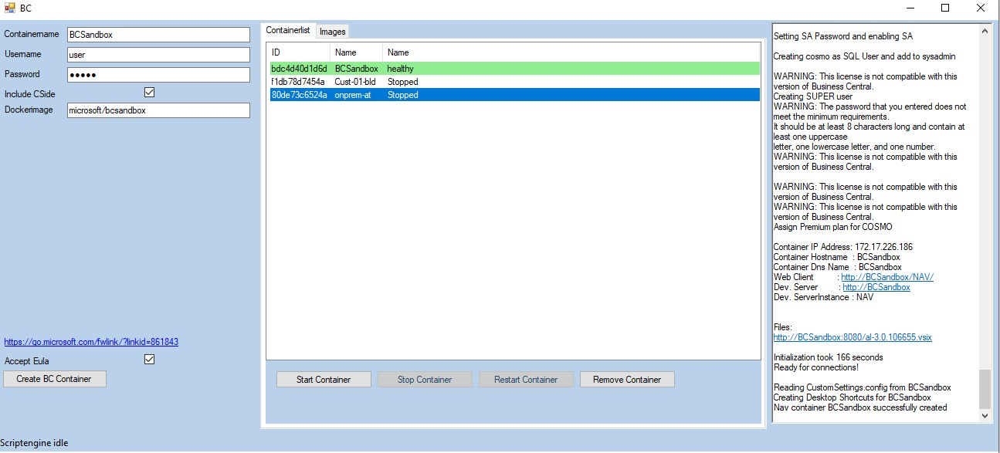

# BCContainerHelperGUI
User Interface for simple use of the Powershell Moduel navcontainerhelper
During the first start navcontainerhelper is getting installed. 

I am working on this project in my free time so it could take some time to implement new Features

## Installation
Just Download [Release.zip](../../releases/download/v1.0.0.1/Release.zip) from realase Section, unzip and run

## Requirements
* Powershell 3.0
* .net Framerwork 4.6.1
* Docker 

## Features
* Create Dockercontainer using navcontainerhelper
* List all local containers
* Start/Stop/Restart/Remove Dockercontainer using navcontainerhelper
* List all Images with Tagname and Size
* Delete Images

## Upcomming Features
* Publish Apps to Container
* Support more Parameters from navcontainerhelper
* Support Windows Authentification

